# PowerSync Extension and Middleware Architecture

This document describes how we extend PowerSync to transform sync data via a middleware pipeline.

## Overview

We extend the official PowerSync SDK (`@powersync/web`) with a custom database class and bucket storage that intercept sync data before it reaches the local SQLite database. This enables encryption, format conversion, and other transformations without forking the SDK.

### Extension hierarchy

```
PowerSyncDatabase (@powersync/web)
    └── ThunderboltPowerSyncDatabase (our extension)
            └── overrides generateBucketStorageAdapter()

SqliteBucketStorage (@powersync/common)
    └── TransformableBucketStorage (our extension)
            └── overrides control()
```

## ThunderboltPowerSyncDatabase

**File:** [src/db/powersync/ThunderboltPowerSyncDatabase.ts](../src/db/powersync/ThunderboltPowerSyncDatabase.ts)

Extends `PowerSyncDatabase` from `@powersync/web`. Adds support for a `transformers` option and supplies our custom bucket storage adapter instead of the default `SqliteBucketStorage`.

### Options type

```typescript
type ThunderboltPowerSyncOptions = WebPowerSyncDatabaseOptions & {
  transformers?: DataTransformMiddleware[]
}
```

All options from `WebPowerSyncDatabaseOptions` (database, schema, flags, etc.) are inherited. The only addition is `transformers`, an optional array of middleware instances.

### Override: generateBucketStorageAdapter()

**Method:** `protected generateBucketStorageAdapter(): BucketStorageAdapter`

The official `PowerSyncDatabase` creates a plain `SqliteBucketStorage` here. We override to:

1. Instantiate `TransformableBucketStorage` (passing `this.database` as the DBAdapter)
2. Register each transformer from `options.transformers` via `storage.addTransformer(t)`
3. Return the storage as the bucket storage adapter

The adapter is used by the Rust sync client for all sync operations. When sync data arrives, it calls `adapter.control(PROCESS_TEXT_LINE, payload)` — which hits our `TransformableBucketStorage.control()`.

## TransformableBucketStorage

**File:** [src/db/powersync/TransformableBucketStorage.ts](../src/db/powersync/TransformableBucketStorage.ts)

Extends `SqliteBucketStorage` from `@powersync/common`. Adds a transformer pipeline and overrides `control()` to run it on incoming sync data.

### Transformer management

| Method | Purpose |
|--------|---------|
| `addTransformer(transformer)` | Registers a transformer. Order matters: first added runs first. |
| `removeTransformer(transformer)` | Removes a previously added transformer. |
| `clearTransformers()` | Clears all transformers from the pipeline. |

### Override: control()

**Method:** `async control(op: PowerSyncControlCommand, payload: string | Uint8Array | ArrayBuffer | null): Promise<string>`

The Rust client calls this when it receives sync data. We intercept only when:

- `op === PowerSyncControlCommand.PROCESS_TEXT_LINE`
- `payload` is a string (JSON)
- `this.transformers.length > 0`

**What it does:**

1. Parse `payload` as JSON: `{ data?: SyncDataBucketJSON }`
2. If `line.data` exists, build a `SyncDataBatch` from it (`SyncDataBucket.fromRow` → `new SyncDataBatchClass([bucket])`)
3. Run `runTransformers(batch)` — each transformer receives the batch and returns the (possibly modified) batch
4. Re-serialize the transformed batch: `JSON.stringify({ data: transformed.buckets[0].toJSON(true) })`
5. Call `super.control(op, transformedPayload)` to pass the transformed payload to the WASM engine

All other commands (STOP, START, PROCESS_BSON_LINE, etc.) pass through unchanged to `super.control()`.

## DataTransformMiddleware interface

**Defined in:** [TransformableBucketStorage.ts](../src/db/powersync/TransformableBucketStorage.ts)

```typescript
type DataTransformMiddleware = {
  transform(batch: SyncDataBatch): Promise<SyncDataBatch> | SyncDataBatch
}
```

- **Input:** `SyncDataBatch` — contains `buckets: SyncDataBucket[]`. Each bucket has `data: OplogEntry[]`. Each `OplogEntry` has `object_type` (table name), `object_id`, and `data` (JSON string of column values).
- **Output:** The same or a modified `SyncDataBatch`. Mutating in place is fine.
- **Order:** First registered runs first. Each transformer receives the output of the previous.

## Database initialization

**File:** [src/db/powersync/database.ts](../src/db/powersync/database.ts)

When the app uses PowerSync, `DatabaseSingleton` creates a `ThunderboltPowerSyncDatabase` with:

```typescript
const options: ThunderboltPowerSyncOptions = {
  database: { dbFilename },
  schema: AppSchema,
  transformers: [encryptionMiddleware],
  flags: { enableMultiTabs: false, useWebWorker: false },
}
this.powerSync = new ThunderboltPowerSyncDatabase(options)
```

**Required flags:** `enableMultiTabs` and `useWebWorker` must be `false`. When either is `true`, PowerSync uses a SharedWorker that creates its own storage and bypasses our adapter. Our `TransformableBucketStorage` would never receive sync data.

## Flowchart

```mermaid
flowchart LR
    subgraph init [Initialization - database.ts]
        Options[ThunderboltPowerSyncOptions<br>transformers: encryptionMiddleware<br>flags: enableMultiTabs false, useWebWorker false]
        DbCtor[ThunderboltPowerSyncDatabase.ts<br>new ThunderboltPowerSyncDatabase]
        GenAdapter[generateBucketStorageAdapter override]
        CreateStorage[new TransformableBucketStorage<br>addTransformer for each in options.transformers]
        Options --> DbCtor
        DbCtor --> GenAdapter
        GenAdapter --> CreateStorage
    end

    subgraph download [Download Flow]
        Server[PowerSync Server]
        AdapterControl[adapter.control<br>PROCESS_TEXT_LINE]
        ControlOverride[TransformableBucketStorage.ts<br>control override]
        ParsePayload[parse payload<br>SyncDataBucket.fromRow]
        RunTransformers[runTransformers<br>for each in this.transformers]
        EncryptTransform[EncryptionMiddleware.ts<br>transform batch]
        SuperControl[super.control<br>transformedPayload]
        WASM[WASM Engine]
        Server --> AdapterControl
        AdapterControl --> ControlOverride
        ControlOverride --> ParsePayload
        ParsePayload --> RunTransformers
        RunTransformers --> EncryptTransform
        EncryptTransform -->|"decrypt tasks.item<br>object_type === tasks"| SuperControl
        SuperControl --> WASM
    end

    subgraph upload [Upload Flow]
        CrudQueue[(ps_crud)]
        GetTx[connector.ts<br>getNextCrudTransaction]
        MapOps[map transaction.crud<br>to op, type, id, data]
        EncryptStep["if op.table === tasks<br>encrypt op.opData.item"]
        FetchPut[fetch PUT<br>backendUrl/powersync/upload]
        Complete[transaction.complete]
        CrudQueue --> GetTx
        GetTx --> MapOps
        MapOps --> EncryptStep
        EncryptStep --> FetchPut
        FetchPut --> Complete
    end
```



## SyncDataBatch structure

From `@powersync/common`:

- **SyncDataBatch** — `{ buckets: SyncDataBucket[] }`
- **SyncDataBucket** — `{ bucket: string, data: OplogEntry[], has_more, after, next_after }`
- **OplogEntry** — `{ op_id, op, checksum, object_type, object_id, data }`
  - `object_type` = table name (e.g. `"tasks"`)
  - `object_id` = row id
  - `data` = JSON string of column values (e.g. `'{"id":"x","item":"...","user_id":"y"}'`)

Transformers parse `entry.data` as JSON, modify the object, and re-stringify.

## EncryptionMiddleware

**File:** [src/db/powersync/middleware/EncryptionMiddleware.ts](../src/db/powersync/middleware/EncryptionMiddleware.ts)

Implements `DataTransformMiddleware`. For each `OplogEntry` where `object_type === 'tasks'`:

1. Parse `entry.data` as JSON
2. If `obj.item` is a string and passes validation (currently: valid base64), decrypt it
3. Re-stringify and assign back to `entry.data`

Other tables and columns are left unchanged. Will evolve to a full encryption layer for all tables/columns.

## Upload flow (ThunderboltConnector)

**File:** [src/db/powersync/connector.ts](../src/db/powersync/connector.ts)

`ThunderboltConnector` implements `PowerSyncBackendConnector`. The `uploadData(database)` method:

1. Calls `database.getNextCrudTransaction()` to get the next batch of local changes
2. Maps `transaction.crud` to API format: `{ op, type, id, data }`
3. **Encryption step:** For each op where `op.table === 'tasks'` and `op.op` is PUT or PATCH, if `op.opData.item` is a string, encrypt it before including in `data` (currently base64 placeholder)
4. Sends `PUT ${backendUrl}/powersync/upload` with `{ operations }`
5. On success, calls `transaction.complete()` so PowerSync marks the batch as uploaded

Encryption happens in the connector because the upload path does not go through the transformer pipeline — CRUD is read directly from `ps_crud` and sent to the backend.

## Download flow (sync → local)

1. PowerSync Server sends sync data to the client
2. Rust Sync Client receives it and calls `adapter.control(PROCESS_TEXT_LINE, payload)`
3. **TransformableBucketStorage.control()** intercepts the call
4. Parses the payload into a `SyncDataBatch` (buckets with OplogEntry data)
5. Runs each registered transformer in order (e.g. EncryptionMiddleware)
6. Re-serializes the transformed batch and calls `super.control()` to pass it to the WASM engine
7. WASM engine writes to local SQLite

## Diagram node → file mapping

| Node | File |
|------|------|
| TransformableBucketStorage.control | [TransformableBucketStorage.ts](../src/db/powersync/TransformableBucketStorage.ts) |
| EncryptionMiddleware.transform | [EncryptionMiddleware.ts](../src/db/powersync/middleware/EncryptionMiddleware.ts) |
| ThunderboltConnector.uploadData | [connector.ts](../src/db/powersync/connector.ts) |

## File reference

| File | Purpose |
|------|---------|
| [ThunderboltPowerSyncDatabase.ts](../src/db/powersync/ThunderboltPowerSyncDatabase.ts) | Extends `PowerSyncDatabase`; adds `transformers` option; overrides `generateBucketStorageAdapter()` |
| [TransformableBucketStorage.ts](../src/db/powersync/TransformableBucketStorage.ts) | Extends `SqliteBucketStorage`; defines `DataTransformMiddleware`; overrides `control()`; runs transformer pipeline |
| [EncryptionMiddleware.ts](../src/db/powersync/middleware/EncryptionMiddleware.ts) | Decrypts `tasks.item` on download |
| [connector.ts](../src/db/powersync/connector.ts) | Implements `PowerSyncBackendConnector`; encrypts `tasks.item` in `uploadData()` before sending |
| [database.ts](../src/db/powersync/database.ts) | Instantiates `ThunderboltPowerSyncDatabase` with `transformers: [encryptionMiddleware]` and required flags |

## Constraints

- `enableMultiTabs` and `useWebWorker` must be `false` – otherwise PowerSync uses a SharedWorker that creates its own storage and bypasses our adapter
- Middleware runs in the main thread
